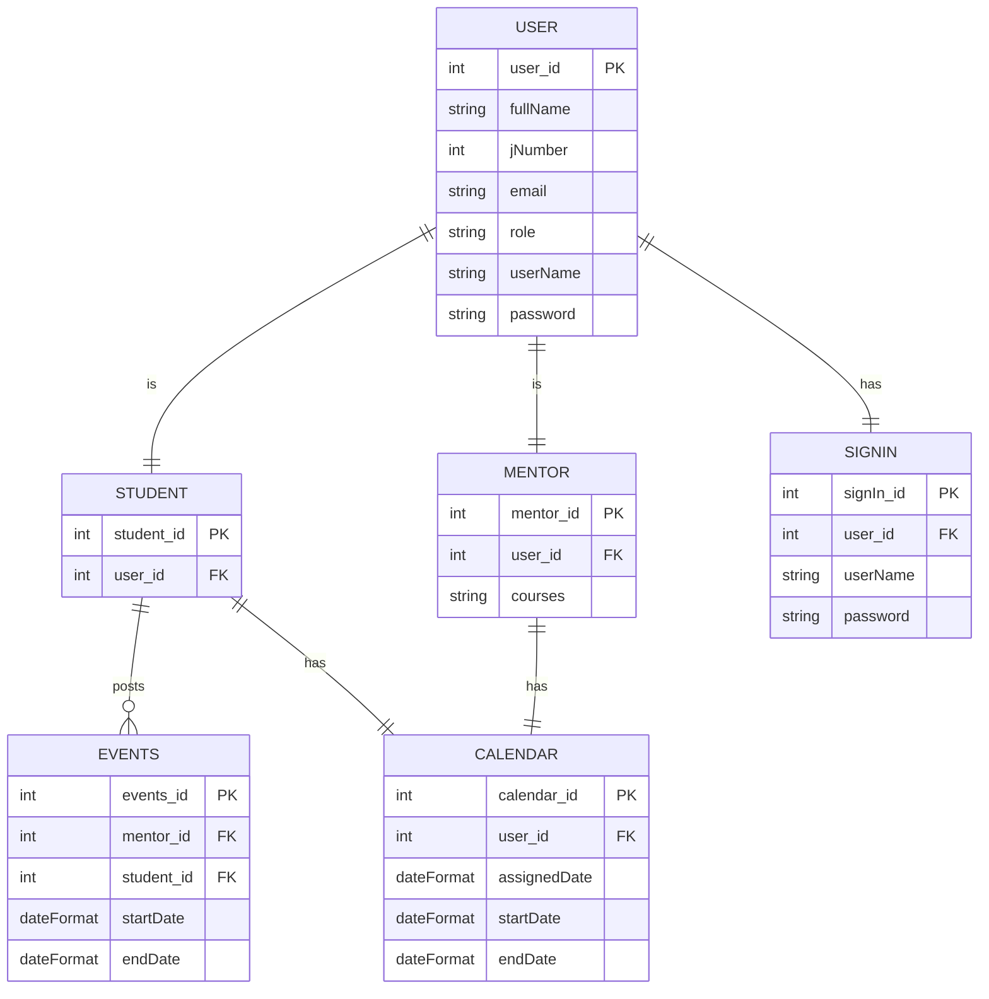

# ER Diagram

### Entities are

   USER | STUDENT | MENTOR | SIGN IN | EVENTS | CALENDAR.  
    The USER can be either a student, a mentor or admin
    which is assigned by the 'role' attribute in the user table.
  Events is transaction that is posted when     a   student is
   booked for mentorship program.

