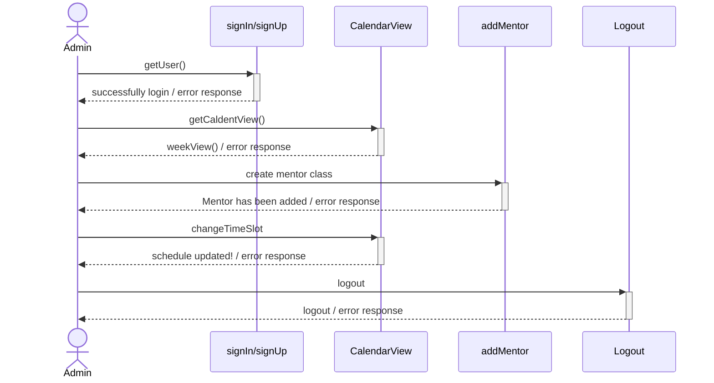
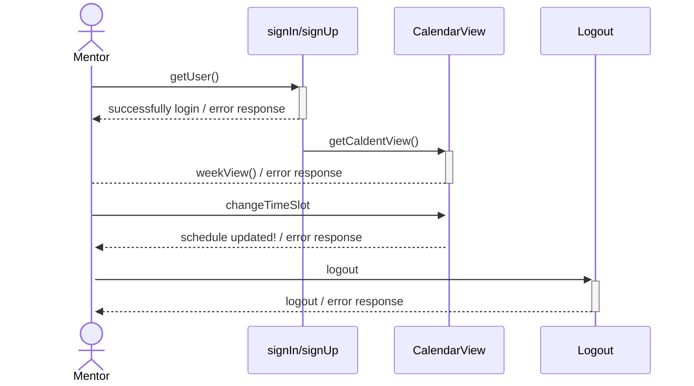
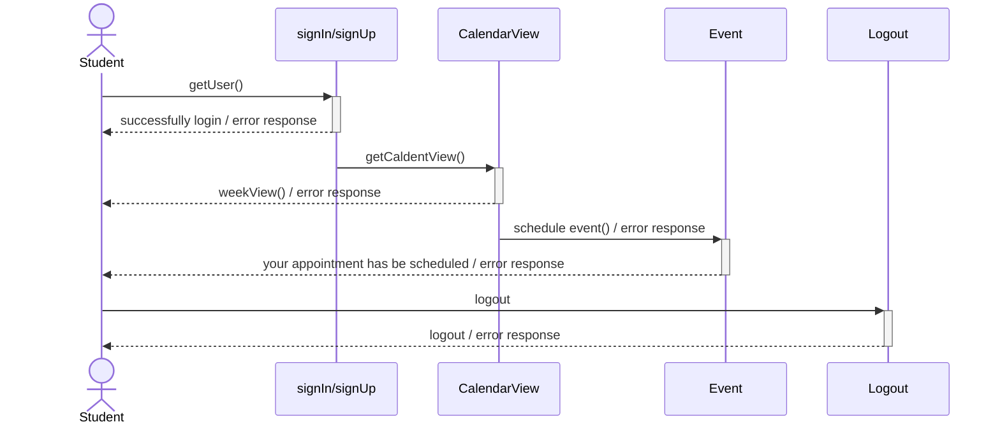

# Scholars-Academy-Overview

## Sequence Diagram for Admin

```mermaid
    sequenceDiagram
        actor Admin
        Admin->>+signIn/signUp: getUser() 
        signIn/signUp-->>-Admin: successfully login / error response
        Admin->>+CalendarView: getCaldentView() 
        CalendarView-->>-Admin: weekView() / error response
        Admin->>+addMentor: create mentor class 
        addMentor-->>-Admin: Mentor has been added / error response
        Admin->>+CalendarView: changeTimeSlot   
        CalendarView-->>-Admin: schedule updated! / error response
        Admin->>+Logout: logout 
        Logout-->>-Admin: logout / error response
```

## Sequence Diagram for Mentor

```mermaid
    sequenceDiagram
        actor Mentor
        Mentor->>+signIn/signUp: getUser() 
        signIn/signUp-->>-Mentor: successfully login / error response
        signIn/signUp->>+CalendarView: getCaldentView() 
        CalendarView-->-Mentor: weekView() / error response
        Mentor->>+CalendarView: changeTimeSlot   
        CalendarView-->>+Mentor: schedule updated! / error response
        Mentor->>+Logout: logout 
        Logout-->>-Mentor: logout / error response
```

## Sequence Diagram for Student

```mermaid
    sequenceDiagram
        actor Student
        Student->>+signIn/signUp: getUser() 
        signIn/signUp-->>-Student: successfully login / error response
        signIn/signUp->>+CalendarView: getCaldentView() 
        CalendarView-->>-Student: weekView() / error response 
        CalendarView->>+Event: schedule event() / error response 
        Event-->>-Student: your appointment has be scheduled / error response 
        Student->>+Logout: logout 
        Logout-->>-Student: logout / error response 

```
