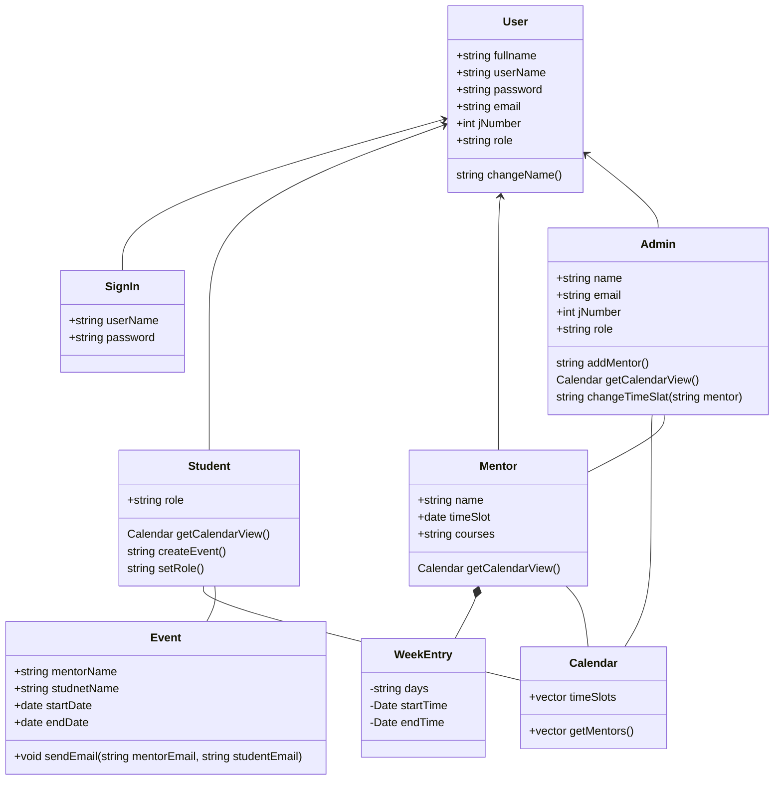

# Scholars-Academy-Overview

## Object Model Diagram

```mermaid
    classDiagram

        User <-- SignIn
        User <-- Student
        User <-- Mentor
        User <-- Admin
        Mentor *-- WeekEntry
        Student -- Calendar
        Mentor -- Calendar
        Admin -- Calendar
        Admin -- Mentor
        Student -- Event

        class Admin
        Admin: +string name 
        Admin: +string email
        Admin: +int jNumber
        Admin: +string role
        Admin: string addMentor()
        Admin: Calendar getCalendarView()
        Admin: string changeTimeSlat(string mentor)

        class User
        User: +string fullname 
        User: +string userName 
        User: +string password 
        User: +string email
        User: +int jNumber
        User: +string role
        User: string changeName()

        class Event
        Event: +string mentorName 
        Event: +string studnetName 
        Event: +date startDate
        Event: +date endDate
        Event: +void sendEmail(string mentorEmail, string studentEmail)

        class Mentor
        Mentor: +string name 
        Mentor: +date timeSlot
        Mentor: +string courses 
        Mentor: Calendar getCalendarView()

        class Calendar
        Calendar: +vector<Mentors> getMentors()
        Calendar: +vector timeSlots 


        class Student
        Student: +string role
        Student: Calendar getCalendarView()
        Student: string createEvent()
        Student: string setRole()

        class WeekEntry
        WeekEntry: -string days 
        WeekEntry: -Date startTime 
        WeekEntry: -Date endTime 

        class SignIn
        SignIn: +string userName
        SignIn: +string password

```
