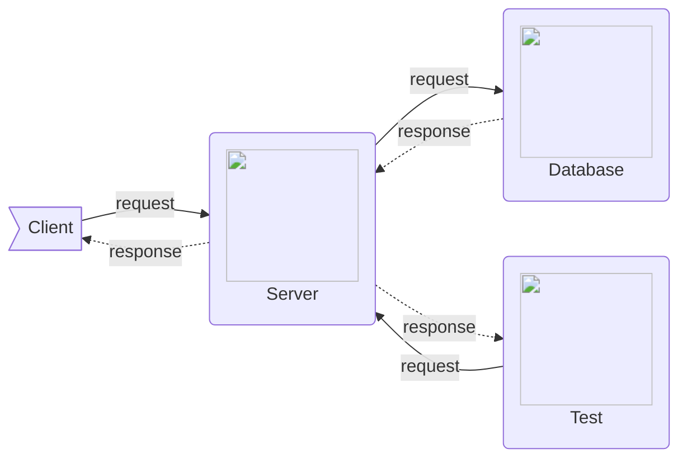

# sap-web

Scholar Academy  Project

- interface/transitional class
- Database

## Workflow

Under the `install` folder you will find `macInstall.sh` or `windowInstall.bat` base on your OS you can run either or. Once you run the installers, you should have Docker and VScode installed. If you are on windows you will have `wsl2` installed on your machine.

If that went perfectly, you can run the `vsextensionInstaller.sh` on your terminal (`wsl` if you are on windows). This will install all the necessary extension for you to work with `docker` on VScode.

...

## Project Overview

This is how the container will be setup.

...

