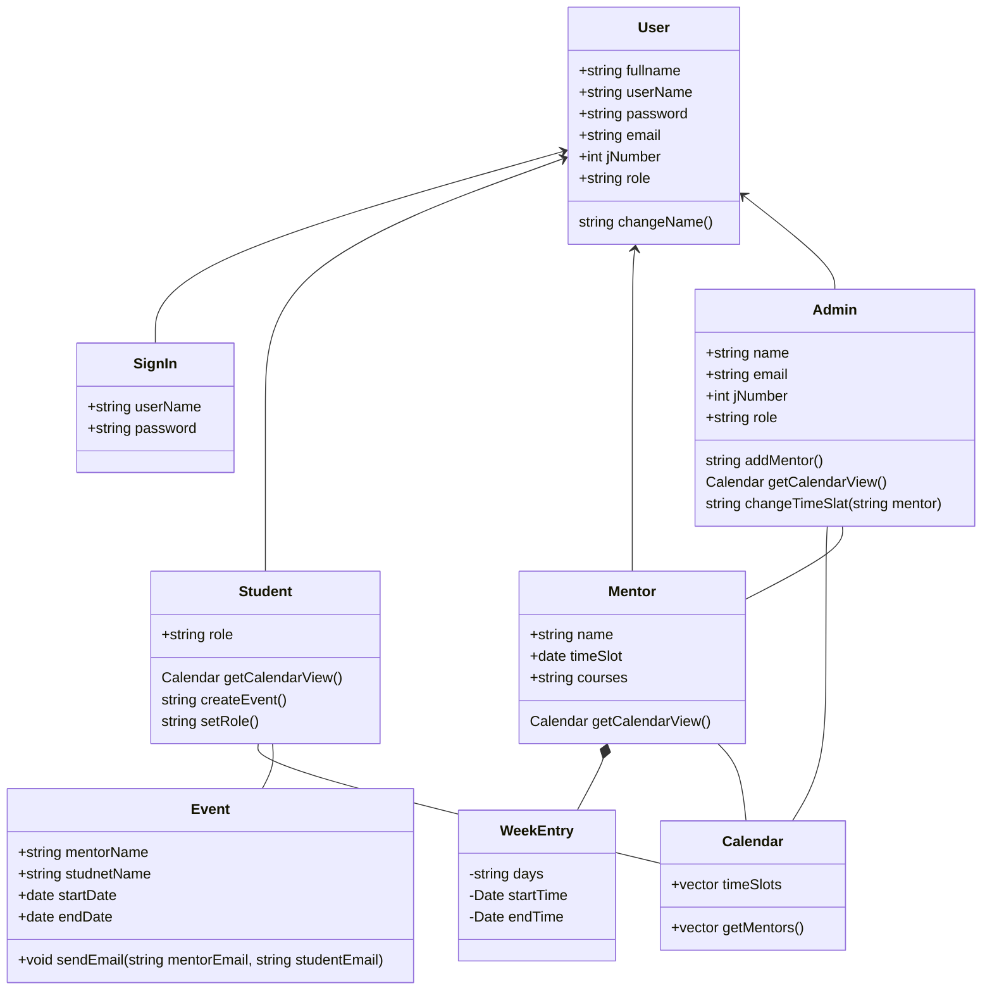
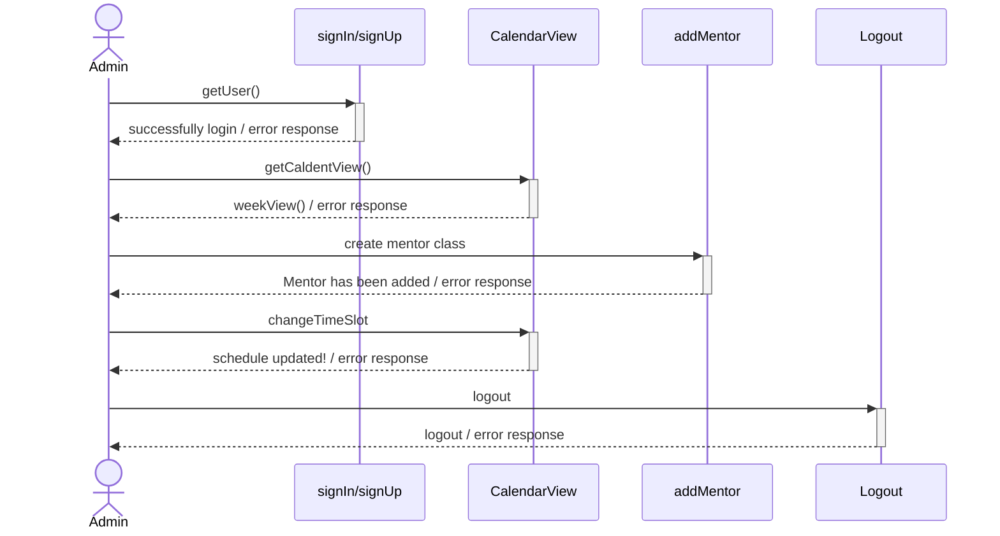
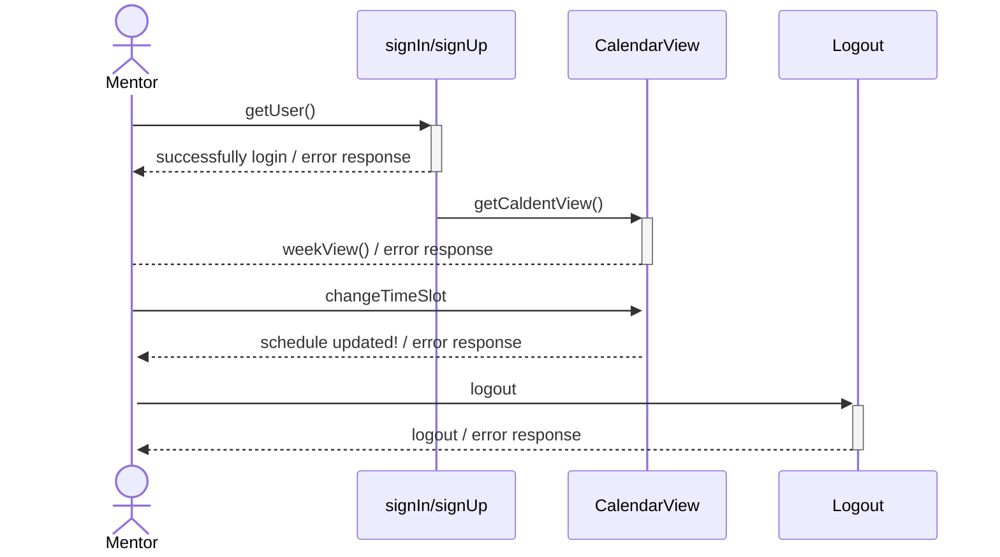
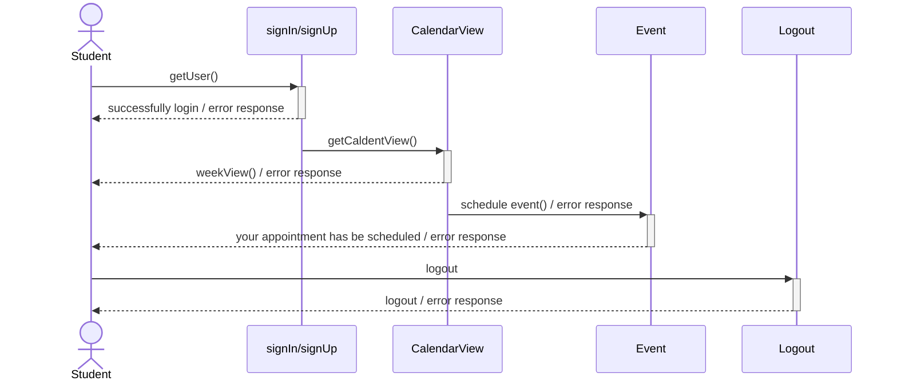

# sap-web
Scholar Academy  Project

# Scholars-Academy-Overview

Object Model Diagram
- interface/transitional class
- Database 

Sequence Diagram for Admin

Sequence Diagram for Mentor

Sequence Diagram for Student

